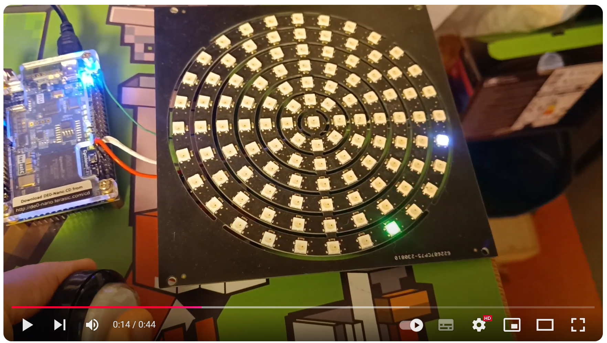
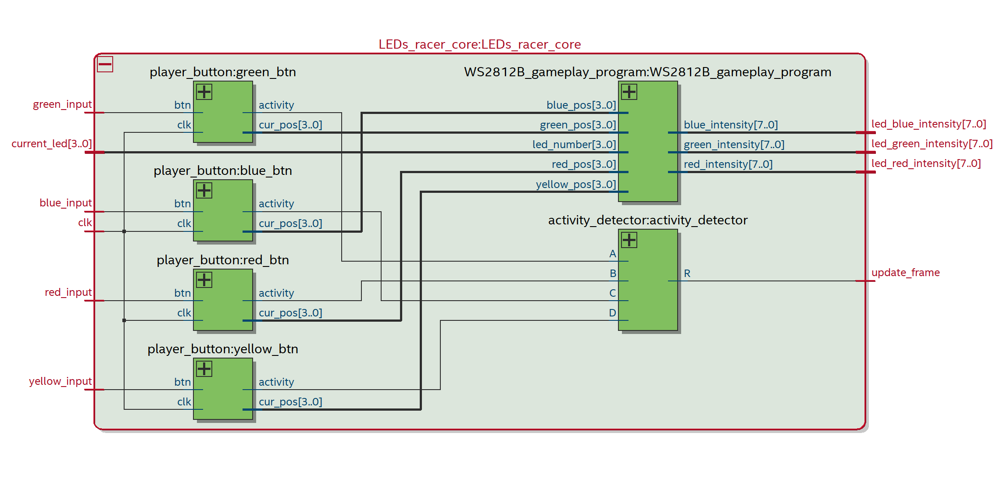
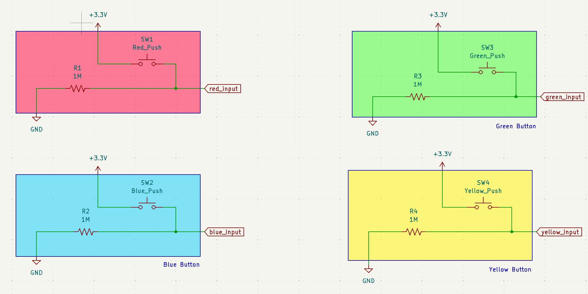

# FPGA Leds Racer

Tiny Tapeout Actions

   

## Description

A fun little game, 4 players (Red, Blue, Green, Yellow) around a table, each with an arcade button, must challenge each other by pressing their button as fast as possible.

Pressing the button causes their led to progress to the center circle. The first to reach the center wins.

## Hardware

I'm putting here the material I used for the project, but of course if it's compatible this list can be adapted.

- 4 x **Arcade buttons** (https://www.amazon.fr/EG-STARTS-Nouveau-Boutons-poussoirs-lumineux/dp/B01MSNXLN0/)
- 1 x **LEDs Circles (with WS2812B Leds)** (https://www.amazon.fr/Treedix-anneaux-WS2812B-adressable-Raspberry/dp/B0CD3DYJRK/)
- 1 x **FPGA DE0 Nano** (https://www.mouser.fr/ProductDetail/Terasic-Technologies/P0082?qs=ePbE9GiMmvUo6nLfdjJv4g%3D%3D)

## Software IDE

I'm putting here the software I use for development to date. It's possible that these technical considerations may change depending on the target material.

- Quartus Prime Lite
- Questa Sim

## Install

Go to this [install guide](./docs/install.md)

## Run Unit Test Benches (With VUnit)

Require **Docker Client** installed and just run :

`./run_tests.sh`

## Actual State
**549** Logic Element (LE) - **232** Registers

I concentrated mainly on implementing the WS2812B LED driver. With the help of the testbench tool, I implemented tests as I went along in order to discover the communication algorithm with the WS2812B LED serial line.

the project works correctly End to End with DE0 Nano device.

### Todo options

- Music
- Random traps
- [Electronic Experimentation] Reduce number of CLK edges required to debounce button, it could be interesting to test with a capacitor.

### Identified problems

- From Test Bench we identify a problem about the RED Player led seems move two positions direcly : it's described in [LEDs_racer_main_tb](./LEDs_racer_main_tb.vhd#L414) / [this doc](./docs/sim_counter_problem.md)

## Architecture (Top View Usage)

|  pin input   | input description  |   output description             |  pin output                    |
|  :---   |  :--- | ---:                         |  ---:                    |
|  **clk**  |  50 Mhz clock input signal  |  WS2812B transmission  |  **leds_line**  |
|  **red_input**  |  Player Red input (connected to Red button) or Grounded  |    |  |
|  **green_input**  |  Player Green input (connected to Green button) or Grounded  |    |  |
|  **blue_input**  |  Player Blue input (connected to Blue button) or Grounded  |    |  |
|  **yellow_input**  |  Player Yellow input (connected to Yellow button) or Grounded  |    |  |

### LEDs Racer Core Architecture

### See more about sub-components

- [Button Debouncer](https://github.com/KerCrafter/button-debouncer)
- [Player Button](./docs/player_button.md)
- [Activity Detector](./docs/activity_detector.md)
- [WS2812B Driver](https://github.com/KerCrafter/WS2812B-driver)
- [WS2812B Gameplay Program](./docs/ws2812b_gameplay_program.md)

## Schematic

### Buttons

Should be connected to the FPGA inputs with a pull down resistor (note: not sure 1M is an ideal value)

[race_4_players.kicad_sch](./schematic/race_4_players/race_4_players.kicad_sch)
