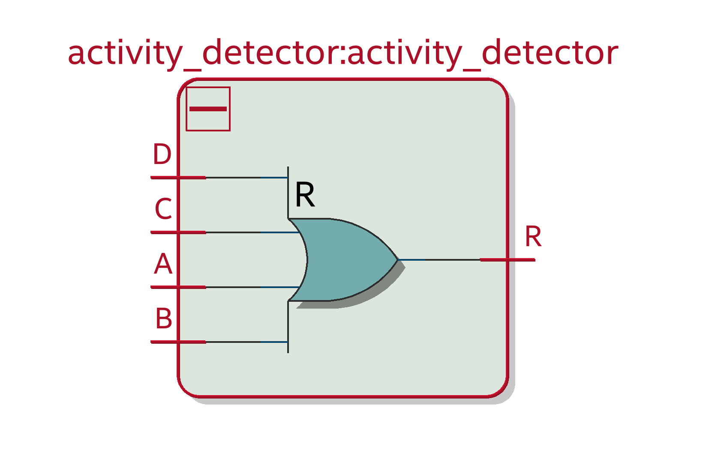

# Activity Detector

Manage the 4 buttons activity signals (typically a simple 4 input OR)

## Responsabilities :

- Merge the buttons activity signals

## RTL Architecture

|  pin input   | input description  |   output description             |  pin output                    |
|  :---   |  :--- | ---:                         |  ---:                    |
|  **A**  |  Player Activity signal  |  Merge result  |  **R**  |
|  **B**  |  Player Activity signal  |  |  |
|  **C**  |  Player Activity signal  |  |  |
|  **D**  |  Player Activity signal  |  |  |
