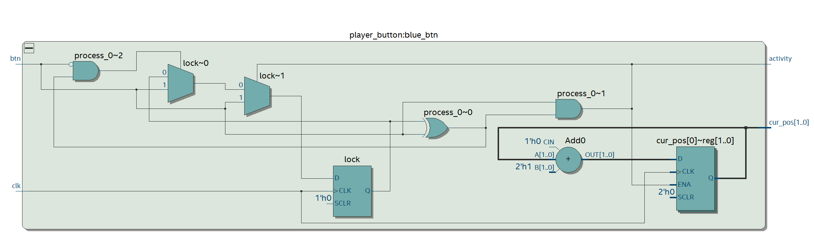

# Player Button

Manage the input for ONE player, typically Yellow player implement one instance of this

## Responsabilities :

- Increments a counter at each press into the button
- Send a short impulsion just to inform that the displayed informations has changed

## RTL Architecture

|  pin input   | input description  |   output description             |  pin output                    |
|  :---   |  :--- | ---:                         |  ---:                    |
|  **clk**  |  50 Mhz clock input signal  |  Up to HIGH during one clk cycle when button is pressed  |  **activity**  |
|  **btn**  |  Connected to the button  | Actual position of the player | **cur_pos[1..0]** |
