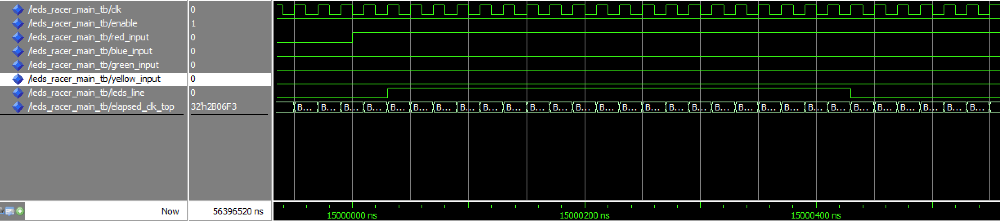

# Simulation Problem

In my Quartus environment, Using Questa Sim. A player counter seems Move to 2 positions instead of expected 1 postion.

Execution of [LEDs_racer_main_tb.vhd](../LEDs_racer_main_tb.vhd)

## Test Flow

Starting, `enable` pin is LOW state. Then we assume Red / Green / Blue / Yellow players are at position `0`.

When I change `enable` (not correcly named, may be `start` pin) to HIGH : First data frame is sent to LEDs via output `leds_line`
Via the Test Bench we assert signal sent is correct, then :

 - First LED is White (Players Red + Green + Blue + Yellow are here).
 - Next LEDs are Black (Lights off)

When Red Player press in his button, `red_input` is HIGH : Second data frame is sent

 - First LED is White (Players Green + Blue + Yellow are here)
 - Second LED is Red (Only Red player is here)
 - Next LEDs are Black (Lights off)

When Red Player press in his button second times, `red_input` is HIGH : 3rd data frame is sent

 - First LED is White (Players Green + Blue + Yellow are here)
 - Second LED is Black (no player is here)
 - 3rd LED is Black (no player is here)
 - 4th LED is Red (Only Red player is here)
 - Next LEDs are Black (Lights off)

To manange the position of Players, the Entity [Player Button](../player_button.vhd) implement a counter. The same tests with `3-bit` counter works fine.

- I use `numeric std` to use `integer` for `+1` operation. it implement a `Binary Adder`. other possible implementation may be implement a `Binary Counter` with nested FF.

- Independently, I've add a Test Bench to test only the [Player Button](../player_button.vhd) in [Player Button Test Bench](../player_button_tb.vhd), this test display a very good behaviour for this component.

Player Button Test Bench Result
