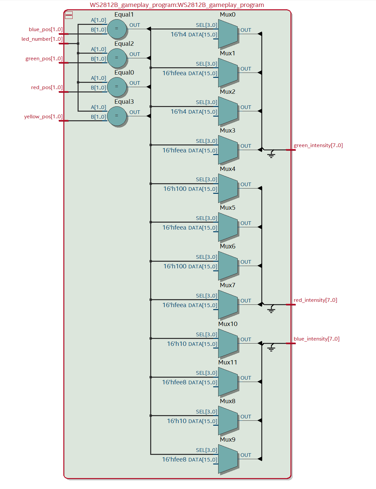

# WS2812B Gameplay Program

Displaying logic per LEDs. designed to work with WS2812B Driver.

## Responsabilities :

- Receive players positions 
- Reveive position of current LED should be coded
- Send Green/Red/Blue light intensity for the WS2812B driver

## Displaying Rules

- White (Green: 5, Red: 5, Blue: 5) when 2+ players are in the LED.
- Black (OR light off => Green: 0, Red: 0, Blue: 0) when no players are actually in the LED.
- Green (Green 10, Red: 0, Blue: 0) when only Green player is in the LED.
- Red (Green 0, Red: 10, Blue: 0) when only Red player is in the LED.
- Blue (Green 0, Red: 0, Blue: 10) when only Blue player is in the LED.
- Yellow (Green 5, Red: 5, Blue: 0) when only Yellow player is in the LED.

## RTL Architecture 

|  pin input   | input description  |   output description             |  pin output                    |
|  :---   |  :--- | ---:                         |  ---:                    |
|  **led_number[1..0]**  |  Position of the current coded led  |  Green light intensity emited (0 - 255) |  **green_intensity[7..0]**  |
|  **red_pos[1..0]**  |  Position of Red player  | Red light intensity emited (0 - 255) | **red_intensity[7..0]** |
|  **green_pos[1..0]**  |  Position of Green player  | Blue light intensity emited (0 - 255) | **blue_intensity[7..0]** |
|  **blue_pos[1..0]**  |  Position of Blue player  | | |
|  **yellow_pos[1..0]**  |  Position of Yellow player  | | |
